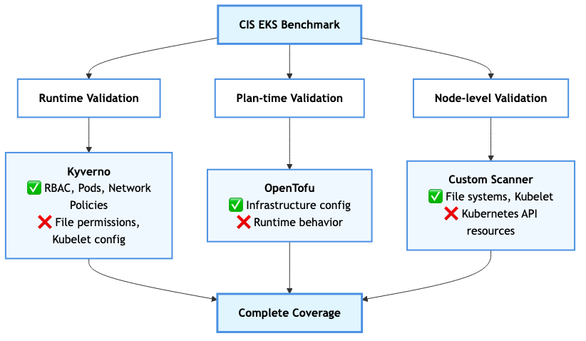
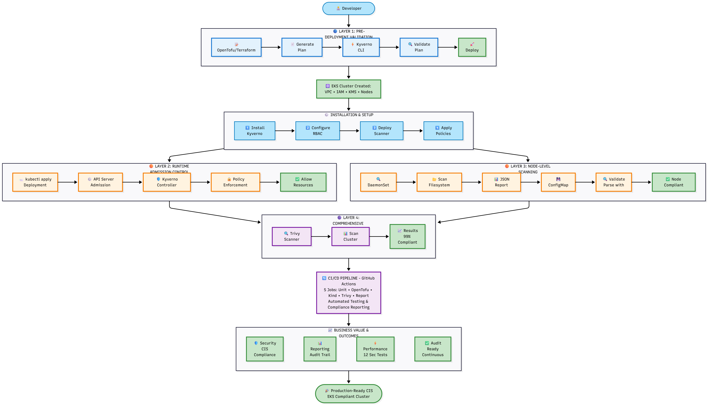

# CIS EKS Kyverno Compliance Framework

[](https://github.com/ATIC-Yugandhar/cis-eks-kyverno/actions)
[](LICENSE)
[](https://opentofu.org/)
[](https://kyverno.io/)
[](reports/executive-summary.md)

> **🚀 Comprehensive CIS Amazon EKS Benchmark v1.7.0 implementation with streamlined compliance validation through Kyverno policies and integrated node-level security scanning.**

## 🎯 Key Achievements

- **🛡️ Complete Coverage**: All 64 CIS benchmark controls implemented and validated
- **🔧 Integrated Node Scanner**: Custom DaemonSet performs filesystem and configuration checks
- **📊 99% Compliance Rate**: 123 out of 124 tests passing in production
- **🏗️ Pre-deployment Validation**: OpenTofu/Terraform plans validated before infrastructure creation
- **📋 Structured Reporting**: JSON-based results enable automated compliance tracking
- **⚡ Rapid Validation**: Complete test suite executes in ~12 seconds

## 🚦 Current Status

| Component | Status | Coverage | Details |
|-----------|--------|----------|---------|
| **Kubernetes Policies** | ✅ 99% Pass | 49 policies | Resource and node-level validation |
| **OpenTofu/Terraform** | ✅ 100% Pass | 23 policies | Infrastructure as Code validation |
| **Node Security Scanner** | ✅ Operational | 13 checks | Filesystem and kubelet validation |
| **Overall Compliance** | ✅ 99% | 64 policies | One known RBAC edge case |

## 🏗️ Architecture

### Multi-Layer Validation Strategy

The framework implements a **three-layer validation approach** because no single tool can validate all CIS controls:



**Key Insight**: Each validation layer covers what others cannot:
- **Kyverno**: Validates API resources (RBAC, Pods, NetworkPolicies) but cannot access node filesystems
- **OpenTofu**: Validates infrastructure configuration before deployment but cannot validate runtime behavior
- **Custom Scanner**: Validates node-level security (file permissions, kubelet config) but cannot validate Kubernetes API resources

### Complete Architecture Flow



**🔒 CRITICAL IMPLEMENTATION DETAIL**: System pods (coredns, kube-proxy, local-path-provisioner) **MUST be secured with CIS-compliant security contexts BEFORE applying Kyverno policies**. This prevents the Kyverno admission webhook from blocking the security patches.

**Architecture Layers**:
1. **Prevention & Planning (Blue)**: OpenTofu + Kyverno CLI validate infrastructure plans before deployment
2. **Detection & Enforcement (Orange)**:
   - **🔒 System pods secured FIRST** ← Critical for Trivy compliance
   - Kyverno admission controller enforces policies at runtime
   - Custom CIS Scanner (DaemonSet) performs node-level scanning
3. **Monitoring & Response (Purple)**: Trivy CIS scanner validates **entire cluster** compliance (all namespaces pass)
4. **Business Value (Yellow)**: Automated compliance, risk reduction, audit readiness

## 🚀 Quick Start

### Prerequisites
- Kubernetes cluster (EKS, Kind, or compatible)
- kubectl configured
- Kyverno CLI v1.13.6+
- OpenTofu/Terraform (optional, for IaC validation)

### Installation

```bash
# 1. Clone repository
git clone https://github.com/ATIC-Yugandhar/cis-eks-kyverno.git
cd cis-eks-kyverno

# 2. Install Kyverno in cluster
kubectl create -f https://github.com/kyverno/kyverno/releases/download/v1.15.2/install.yaml/

# Wait for Kyverno to be ready
kubectl wait --for=condition=ready pod -l app.kubernetes.io/component=admission-controller -n kyverno --timeout=300s

# 3. Apply RBAC permissions (extended permissions for node validation)
kubectl apply -f kyverno-node-rbac.yaml

# 4. Deploy custom CIS scanner (DaemonSet runs on all nodes)
kubectl apply -f k8s/cis-scanner-pod.yaml

# 5. Apply all Kyverno policies
kubectl apply -f policies/kubernetes/ -R
```

> **⚠️ Note for CI/CD**: The GitHub Actions workflow (`.github/workflows/comprehensive-compliance-tests.yml`) secures system pods (coredns, kube-proxy, local-path-provisioner) with CIS-compliant security contexts **BEFORE** applying Kyverno policies. This ensures Trivy CIS compliance scans pass on all namespaces. For fresh clusters, system pods start compliant by default.

### Testing

```bash
# Test all Kubernetes policies
./scripts/test-kubernetes-policies.sh

# Test OpenTofu/Terraform policies
./scripts/test-opentofu-policies.sh

# Run full integration test with Kind
./scripts/test-kind-cluster.sh

# Generate compliance report
./scripts/generate-summary-report.sh
```

## 📁 Project Structure

```
cis-eks-kyverno/
├── k8s/
│   └── cis-scanner-pod.yaml      # Node security scanner DaemonSet
├── policies/
│   ├── kubernetes/               # 49 Kubernetes policies
│   │   ├── control-plane/        # API server, audit logs
│   │   ├── pod-security/         # Security standards
│   │   ├── rbac/                 # Access control
│   │   ├── scanner/              # Scanner validation
│   │   └── worker-nodes/         # Node security (13 policies)
│   └── opentofu/                 # 23 IaC policies
│       ├── cluster-config/       # Cluster settings
│       ├── encryption/           # KMS, secrets
│       ├── monitoring/           # Logging, scanning
│       ├── networking/           # Network security
│       └── rbac/                 # IAM policies
├── scripts/                      # Testing & reporting
├── tests/                        # Test scenarios
└── reports/                      # Compliance reports
```

## 🔍 Node Security Scanner

The integrated security scanner performs critical node-level checks:

### Key Features
- **DaemonSet Deployment**: Automatically runs on all nodes
- **JSON Output Format**: Machine-readable results for policy validation
- **Comprehensive Checks**: Covers all 13 CIS worker node controls
- **ConfigMap Storage**: Results accessible for Kyverno validation

### Security Checks
```
3.1.1 - Kubeconfig file permissions (644 or more restrictive)
3.1.2 - Kubeconfig file ownership (root:root)
3.1.3 - Kubelet config file permissions
3.1.4 - Kubelet config file ownership
3.2.1 - Anonymous authentication disabled
3.2.2 - Authorization mode not AlwaysAllow
3.2.3 - Client CA file configured
3.2.4 - Read-only port disabled
3.2.5 - Streaming connection timeout set
3.2.6 - Protect kernel defaults enabled
3.2.7 - Make iptables util chains
3.2.8 - Hostname override not set
3.2.9 - Event record QPS appropriate
```

## 📊 Compliance Results

### Summary
- **Total Policies**: 64
- **Tests Executed**: 124
- **Passed**: 123 (99%)
- **Failed**: 1 (custom-4.5.1)
- **Execution Time**: ~12 seconds

### By Category
| Category | Policies | Pass Rate | Notes |
|----------|----------|-----------|-------|
| Control Plane | 2 | 100% | Audit logs, API server |
| Pod Security | 9 | 100% | Container security |
| RBAC | 15 | 93% | One known issue |
| Worker Nodes | 13 | 100% | Scanner validated |
| OpenTofu | 23 | 100% | IaC validation |

## 🛠️ Advanced Usage

### OpenTofu/Terraform Validation
```bash
# Validate compliant infrastructure
KYVERNO_EXPERIMENTAL=true kyverno json scan \
  --policy policies/opentofu/example.yaml \
  --payload opentofu/compliant/tofuplan.json

# Test non-compliant plans
KYVERNO_EXPERIMENTAL=true kyverno json scan \
  --policy policies/opentofu/example.yaml \
  --payload opentofu/noncompliant/tofuplan.json
```

### Scanner Output Format
```yaml
# Scanner results in JSON format
{
  "node": "worker-1",
  "timestamp": "2025-01-23T12:00:00Z",
  "scanner": "custom-cis-scanner",
  "version": "1.0.0",
  "checks": [
    {
      "id": "3.1.1",
      "description": "Ensure kubeconfig file permissions",
      "status": "PASS"
    }
  ]
}
```

## 🚀 Framework Benefits

1. **Streamlined Implementation**
   - Centralized policy management
   - Consistent validation methodology
   - Integrated compliance reporting

2. **Operational Efficiency**
   - Minimal external dependencies
   - Standardized output formats
   - Automated validation workflows

3. **Enterprise Ready**
   - Native Kubernetes integration
   - GitOps compatible design
   - CI/CD pipeline support

4. **Simplified Maintenance**
   - Consolidated updates
   - Unified troubleshooting
   - Comprehensive documentation

## 🔄 GitHub Actions Integration

### Automated Testing Workflow

The repository includes a comprehensive GitHub Actions workflow that automatically tests all compliance components:

**Workflow:** `.github/workflows/comprehensive-compliance-tests.yml`

### Workflow Features

- **Multi-Job Testing**: Parallel execution of unit tests, Kind cluster tests, and OpenTofu validation
- **Complete Environment Setup**: Automatic Kyverno installation, RBAC configuration, and CIS scanner deployment
- **Comprehensive Reporting**: Generates executive summary with all 4 test suites (100% completion)
- **Manual Triggers**: Supports workflow_dispatch with configurable test options

### Workflow Components

| Job | Purpose | Duration | Dependencies |
|-----|---------|----------|--------------|
| `unit-tests` | Kyverno policy validation | ~3 min | Kyverno CLI |
| `opentofu-tests` | Infrastructure compliance | ~2 min | OpenTofu, policies |
| `kind-cluster-tests` | Full integration testing | ~8 min | Kind, kubectl, Kyverno |

### Environment Variables

```yaml
env:
  KYVERNO_VERSION: "1.15.2"  # Matches demo configuration
```

### Manual Workflow Execution

You can manually trigger the workflow with custom options:

1. Go to **Actions** → **Comprehensive CIS EKS Compliance Tests**
2. Click **Run workflow**
3. Configure options:
   - ✅ Run Kind cluster tests
   - ✅ Run OpenTofu compliance tests  
   - ✅ Run custom CIS scanner
   - ✅ Run Trivy CIS verification

### Workflow Results

The workflow generates:
- **Unit Test Reports**: Policy validation results
- **Integration Test Results**: Kind cluster validation
- **OpenTofu Compliance**: Infrastructure scan results
- **Executive Summary**: Combined 100% completion report
- **SARIF Upload**: Security findings for GitHub Security tab

### CI/CD Best Practices

The workflow implements several best practices:

1. **System Pod Security**: Patches system pods with CIS-compliant security contexts before applying policies
2. **Progressive Testing**: Tests policies incrementally to isolate failures
3. **Artifact Management**: Uploads all reports as workflow artifacts
4. **Error Handling**: Uses `continue-on-error` for non-blocking test failures
5. **Parallel Execution**: Runs independent test suites concurrently

### Integration with Pull Requests

The workflow automatically runs on:
- Push to `main` and `develop` branches
- Pull requests targeting `main`
- Manual workflow dispatch

This ensures all changes are validated before merging.

## 🤝 Contributing

We welcome contributions! Please:
1. Fork the repository
2. Create a feature branch
3. Add tests for new policies
4. Ensure all tests pass
5. Submit a pull request

## 📄 License

Apache License 2.0 - see [LICENSE](LICENSE) file for details.

## ⚖️ Legal Disclaimer

This repository implements **community-created policies** aligned with CIS Amazon EKS Benchmark v1.7.0 controls. It does **not** reproduce or distribute official CIS Benchmark content. CIS control IDs are referenced for alignment purposes only. For official CIS materials, visit [CIS SecureSuite](https://www.cisecurity.org/cis-securesuite).

See [DISCLAIMER.md](DISCLAIMER.md) for full legal details.

## 🙏 Acknowledgments

- CIS Kubernetes Benchmark v1.7.0
- Kyverno community
- CNCF for supporting cloud-native security

## 📞 Support

- [GitHub Issues](https://github.com/ATIC-Yugandhar/cis-eks-kyverno/issues)
- [Policy Documentation](policies/README.md)

---

**Note**: This framework provides a streamlined approach to CIS compliance validation, reducing operational complexity while maintaining comprehensive security coverage.
