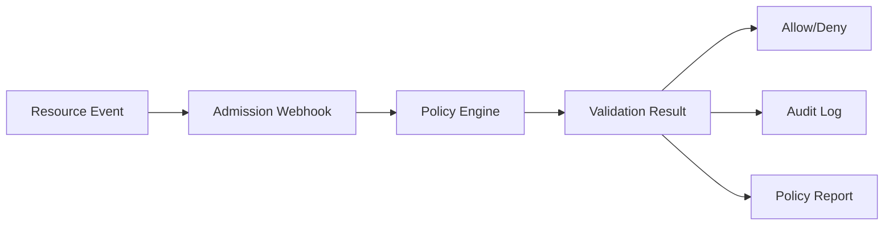
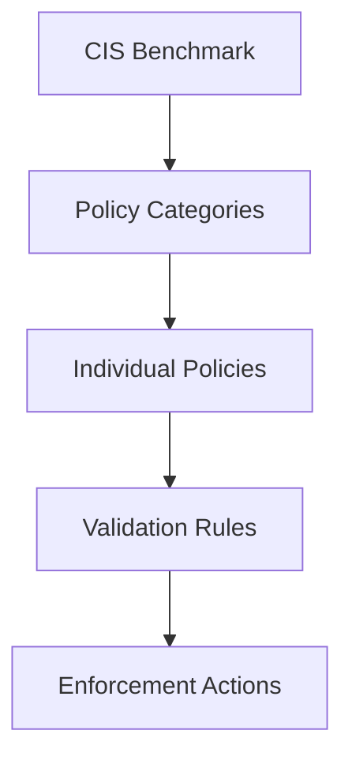
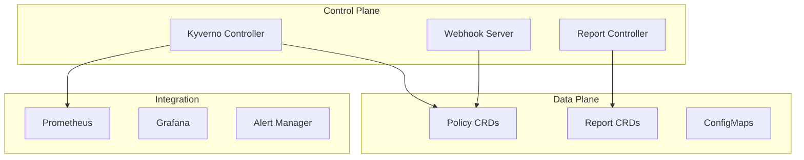

# Architecture Documentation

This section provides detailed technical documentation about the CIS EKS Kyverno Compliance Framework architecture.

## 📑 Documentation Structure

### [Architecture Overview](overview.md)
A high-level view of the framework architecture, including core components, design principles, and technology stack. Start here to understand how all the pieces fit together.

### [Dual Strategy](dual-strategy.md)
Deep dive into our unique approach of combining plan-time (Terraform) and runtime (Kubernetes) validation. Learn why this comprehensive strategy provides superior security coverage.

### [Component Details](components.md)
Technical breakdown of all framework components, their interactions, implementation details, and configuration options. Essential reading for operators and contributors.

## 🏗️ Key Architectural Concepts

### Policy as Code
All compliance rules are defined as declarative YAML policies, enabling:
- Version control and code review
- Automated testing and validation
- GitOps deployment workflows
- Easy updates and rollbacks

### Admission Control
Leveraging Kubernetes admission webhooks for real-time validation:
- Prevents non-compliant resources from being created
- Provides immediate feedback to developers
- Maintains audit trail of all decisions

### Shift-Left Security
Integrating security validation early in the development process:
- Terraform plan validation before infrastructure deployment
- Policy testing in CI/CD pipelines
- Local development validation tools

## 🔄 Architecture Patterns

### Event-Driven Validation

### Policy Hierarchy

### Deployment Architecture

## 🎯 Design Goals

1. **Simplicity**: Easy to understand and operate
2. **Scalability**: Handle enterprise-scale workloads
3. **Reliability**: Fail-safe mechanisms and high availability
4. **Extensibility**: Easy to add new policies and integrations
5. **Performance**: Minimal impact on cluster operations
6. **Security**: Zero-trust approach with defense in depth

## 🔧 Technical Decisions

### Why Kyverno?
- **Native Kubernetes**: No new language to learn
- **Declarative**: Policies as YAML resources
- **Powerful**: Supports validation, mutation, and generation
- **Community**: Active development and support

### Why Dual Strategy?
- **Complete Coverage**: Address both infrastructure and application security
- **Early Detection**: Catch issues before deployment
- **Continuous Enforcement**: Maintain compliance over time
- **Regulatory Compliance**: Meet audit requirements

### Why GitOps?
- **Auditability**: Complete history of all changes
- **Consistency**: Same deployment process everywhere
- **Rollback**: Easy recovery from issues
- **Collaboration**: Standard pull request workflow

## 📊 Architecture Metrics

Key metrics to monitor architecture health:

| Metric | Target | Purpose |
|--------|--------|---------|
| Webhook Latency | < 100ms | User experience |
| Policy Coverage | > 95% | Compliance assurance |
| Validation Success Rate | > 99% | System reliability |
| Memory Usage | < 1GB | Resource efficiency |
| Policy Sync Time | < 5s | Configuration updates |

## 🛠️ Implementation Considerations

### High Availability
- Multiple Kyverno replicas with anti-affinity
- Leader election for controllers
- Webhook failure policies
- Health checks and probes

### Performance
- Policy caching strategies
- Webhook timeout configurations
- Resource filtering optimizations
- Batch processing capabilities

### Security
- RBAC policies for least privilege
- Network policies for traffic control
- TLS encryption for all communications
- Regular security updates

## 🔍 Deep Dive Topics

### For Architects
- Review the [Overview](overview.md) for system design
- Understand the [Dual Strategy](dual-strategy.md) approach
- Explore [Component Details](components.md) for implementation

### For Operators
- Focus on [Components](components.md) configuration
- Review monitoring and metrics sections
- Understand troubleshooting approaches

### For Developers
- Understand the policy structure in [Components](components.md)
- Review the test framework architecture
- Learn about CI/CD integration patterns

## 📚 Related Documentation

- [Getting Started Guide](../getting-started/) - Practical implementation steps
- [Policy Documentation](../policies/) - Detailed policy information
- [Examples](../../examples/) - Real-world implementations
- [Operations Guide](../operations/) - Day-2 operations

## 🤝 Contributing to Architecture

When proposing architectural changes:
1. Document the problem being solved
2. Explain alternative approaches considered
3. Provide implementation details
4. Consider backward compatibility
5. Include migration strategies

See our [Contributing Guide](../contributing/) for more details.

---

> **Note**: This architecture is designed to evolve. We welcome feedback and contributions to improve the framework while maintaining its core principles of simplicity, security, and scalability.