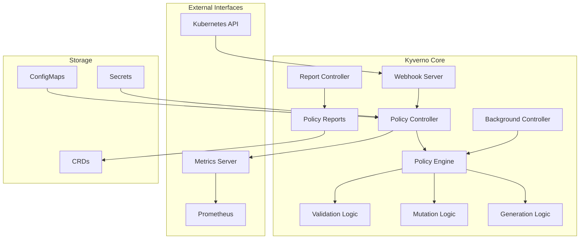
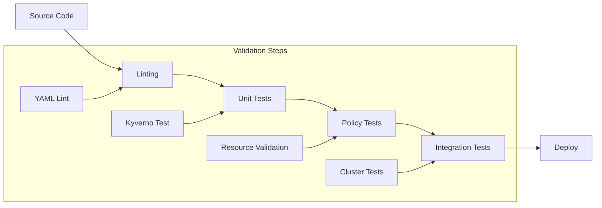
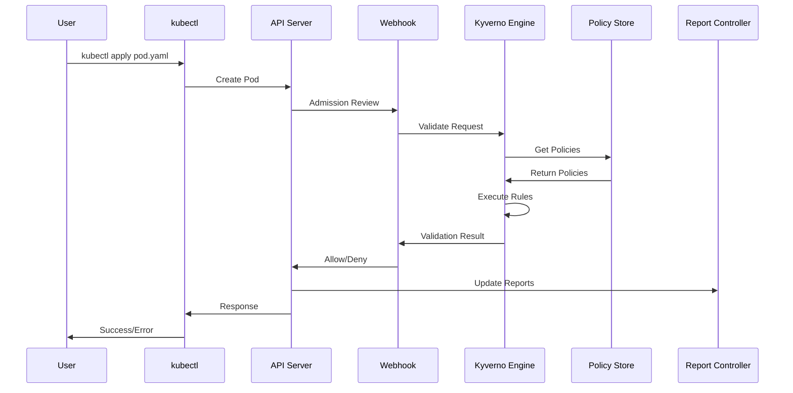

# Component Architecture

## Overview

This document provides a detailed technical breakdown of all components in the CIS EKS Kyverno Compliance Framework, their interactions, and implementation details.

## Core Components

### 1. Kyverno Engine

#### Architecture



#### Key Features

- **Admission Controller**: ValidatingAdmissionWebhook & MutatingAdmissionWebhook
- **Policy Types**: ClusterPolicy (cluster-wide) & Policy (namespaced)
- **Policy Modes**: Enforce, Audit, and Warn
- **Background Processing**: Periodic scanning of existing resources
- **High Availability**: Multi-replica deployment with leader election

#### Implementation Details

```yaml
# Kyverno Deployment Configuration
apiVersion: apps/v1
kind: Deployment
metadata:
  name: kyverno
  namespace: kyverno
spec:
  replicas: 3
  selector:
    matchLabels:
      app: kyverno
  template:
    spec:
      containers:
      - name: kyverno
        image: ghcr.io/kyverno/kyverno:v1.11.0
        args:
          - --loggingFormat=json
          - --v=2
          - --webhooktimeout=30
          - --maxAPICallResponseLength=2000000
        resources:
          requests:
            memory: "256Mi"
            cpu: "100m"
          limits:
            memory: "1Gi"
            cpu: "1000m"
        env:
        - name: KYVERNO_WEBHOOK_CACHE
          value: "true"
        - name: METRICS_CONFIG
          value: "namespaces:include=[\"*\"]"
```

### 2. Policy Components

#### Policy Structure

```yaml
apiVersion: kyverno.io/v1
kind: ClusterPolicy
metadata:
  name: cis-control-policy
  annotations:
    # Metadata for tracking
    policies.kyverno.io/title: "Policy Title"
    policies.kyverno.io/category: "CIS Category"
    policies.kyverno.io/severity: "medium"
    policies.kyverno.io/cis-control: "X.Y.Z"
    # Behavior configuration
    pod-policies.kyverno.io/autogen-controllers: "none"
spec:
  # Validation action
  validationFailureAction: audit|enforce|warn
  
  # Background scanning
  background: true
  
  # Failure policy for webhook errors
  failurePolicy: Fail|Ignore
  
  # Rule definitions
  rules: []
```

#### Rule Types

**1. Validation Rules**
```yaml
validate:
  # Pattern-based validation
  pattern:
    metadata:
      labels:
        environment: "?*"
  
  # Deny-based validation
  deny:
    conditions:
      all:
      - key: "{{ request.object.spec.replicas }}"
        operator: LessThan
        value: 3
```

**2. Mutation Rules**
```yaml
mutate:
  # Strategic merge patch
  patchStrategicMerge:
    metadata:
      labels:
        managed-by: "kyverno"
  
  # JSON patch
  patchesJson6902: |
    - op: add
      path: "/metadata/annotations/security-scan"
      value: "required"
```

**3. Generation Rules**
```yaml
generate:
  kind: NetworkPolicy
  name: "{{ request.object.metadata.name }}-netpol"
  namespace: "{{ request.object.metadata.namespace }}"
  data:
    spec:
      podSelector:
        matchLabels:
          app: "{{ request.object.metadata.name }}"
```

### 3. Policy Repository Structure

#### Directory Organization

```
cis-eks-kyverno/
├── policies/
│   ├── kubernetes/                    # Runtime policies
│   │   ├── control-plane/            # CIS Section 2
│   │   │   ├── custom-2.1.1.yaml    # Enable audit logs
│   │   │   └── custom-2.1.2.yaml    # Log collection
│   │   ├── worker-nodes/             # CIS Section 3
│   │   │   ├── custom-3.1.1.yaml    # File permissions
│   │   │   └── custom-3.2.1.yaml    # Kubelet config
│   │   ├── rbac/                     # CIS Section 4
│   │   │   ├── custom-4.1.1.yaml    # RBAC policies
│   │   │   └── custom-4.2.1.yaml    # Service accounts
│   │   └── pod-security/             # CIS Section 5
│   │       ├── custom-5.1.1.yaml    # Image scanning
│   │       └── custom-5.2.1.yaml    # Security contexts
│   └── terraform/                    # Plan-time policies
│       ├── cis-2.1.1-enable-audit-logs.yaml
│       ├── cis-5.3.1-encrypt-secrets-kms.yaml
│       └── require-tags.yaml
```

#### Policy Naming Convention

```
Format: custom-{section}.{subsection}.{control}-{description}.yaml
Example: custom-5.1.1-image-vulnerability-scanning.yaml

Components:
- custom: Indicates organization-specific implementation
- 5: CIS Section number
- 1: Subsection number
- 1: Control number
- image-vulnerability-scanning: Descriptive name
```

### 4. Test Framework

#### Test Structure

```yaml
# kyverno-test.yaml
apiVersion: cli.kyverno.io/v1alpha1
kind: Test
metadata:
  name: cis-control-test
policies:
  # Policies to test
  - ../../../policies/kubernetes/pod-security/custom-5.1.1.yaml
resources:
  # Resources to validate
  - pod.yaml
results:
  # Expected results
  - policy: custom-5-1-1-image-scanning
    rule: check-image-scanning
    resources:
      - compliant-pod
    kind: Pod
    result: pass
```

#### Test Organization

```
tests/
├── kubernetes/
│   └── custom-5.1.1/
│       ├── compliant/
│       │   ├── kyverno-test.yaml    # Test definition
│       │   └── pod.yaml             # Valid resource
│       └── noncompliant/
│           ├── kyverno-test.yaml    # Test definition
│           └── pod.yaml             # Invalid resource
```

### 5. Validation Pipeline

#### CI/CD Components



#### GitHub Actions Workflow

```yaml
name: Policy Validation
on: [push, pull_request]

jobs:
  validate:
    runs-on: ubuntu-latest
    steps:
      # Setup
      - uses: actions/checkout@v3
      - name: Install Kyverno CLI
        run: |
          curl -L $KYVERNO_URL | tar -xz
          sudo mv kyverno /usr/local/bin/
      
      # Validation
      - name: Validate Policy Syntax
        run: find policies/ -name "*.yaml" -exec kyverno validate {} \;
      
      # Testing
      - name: Run Policy Tests
        run: ./scripts/test-all-policies.sh
      
      # Reporting
      - name: Generate Report
        run: ./scripts/generate-report.sh
      
      - name: Upload Reports
        uses: actions/upload-artifact@v3
        with:
          name: compliance-reports
          path: reports/
```

### 6. Monitoring Stack

#### Metrics Collection

```yaml
# Prometheus ConfigMap
apiVersion: v1
kind: ConfigMap
metadata:
  name: prometheus-config
data:
  prometheus.yml: |
    scrape_configs:
    - job_name: 'kyverno'
      kubernetes_sd_configs:
      - role: pod
        namespaces:
          names:
          - kyverno
      relabel_configs:
      - source_labels: [__meta_kubernetes_pod_label_app_kubernetes_io_name]
        regex: kyverno
        action: keep
      metric_relabel_configs:
      - source_labels: [policy_type]
        regex: 'cluster'
        target_label: scope
        replacement: 'cluster-wide'
```

#### Key Metrics

```prometheus
# Policy execution metrics
kyverno_policy_execution_duration_seconds{policy="cis-5-1-1", rule="check-scanning"}
kyverno_policy_rule_results_total{policy="cis-5-1-1", rule="check-scanning", result="pass"}

# Admission webhook metrics
kyverno_admission_requests_total{resource_kind="Pod", resource_namespace="default"}
kyverno_admission_review_duration_seconds{resource_kind="Pod", operation="CREATE"}

# Resource metrics
kyverno_policy_report_summary{namespace="default", pass="10", fail="2", warn="1", error="0", skip="5"}
```

### 7. Reporting Components

#### Report Generation

```bash
#!/bin/bash
# generate-compliance-report.sh

# Collect policy reports
kubectl get polr -A -o json > policy-reports.json

# Generate summary
jq -r '
  .items[] |
  [.metadata.namespace, .summary.pass, .summary.fail, .summary.warn] |
  @csv
' policy-reports.json > compliance-summary.csv

# Create markdown report
cat > compliance-report.md << EOF
# CIS EKS Compliance Report
Generated: $(date)

## Summary
$(generate_summary)

## Details by Namespace
$(generate_namespace_details)

## Failed Policies
$(generate_failures)
EOF
```

#### Report Types

1. **Policy Reports** (Kubernetes Native)
```yaml
apiVersion: wgpolicyk8s.io/v1alpha2
kind: PolicyReport
metadata:
  name: polr-ns-default
  namespace: default
results:
- message: "Image scanning annotation missing"
  policy: cis-5-1-1-image-scanning
  result: fail
  rule: check-image-scanning
  source: kyverno
  timestamp:
    seconds: 1670000000
```

2. **Cluster Policy Reports** (Cluster-wide)
```yaml
apiVersion: wgpolicyk8s.io/v1alpha2
kind: ClusterPolicyReport
metadata:
  name: clusterpolicyreport
summary:
  error: 0
  fail: 5
  pass: 150
  skip: 10
  warn: 2
```

### 8. Integration Components

#### Webhook Configuration

```yaml
apiVersion: admissionregistration.k8s.io/v1
kind: ValidatingWebhookConfiguration
metadata:
  name: kyverno-resource-validating-webhook-cfg
webhooks:
- name: validate.kyverno.svc
  clientConfig:
    service:
      namespace: kyverno
      name: kyverno-svc
      path: "/validate"
    caBundle: LS0tLS1CRU...
  rules:
  - operations: ["CREATE", "UPDATE"]
    apiGroups: ["*"]
    apiVersions: ["*"]
    resources: ["pods", "services"]
  failurePolicy: Fail
  sideEffects: None
  admissionReviewVersions: ["v1", "v1beta1"]
  timeoutSeconds: 30
```

#### Service Mesh Integration

```yaml
# Istio Integration
apiVersion: security.istio.io/v1beta1
kind: AuthorizationPolicy
metadata:
  name: kyverno-webhook
  namespace: kyverno
spec:
  selector:
    matchLabels:
      app: kyverno
  rules:
  - to:
    - operation:
        paths: ["/validate", "/mutate"]
    from:
    - source:
        namespaces: ["kube-system"]
```

### 9. Security Components

#### RBAC Configuration

```yaml
# ClusterRole for Kyverno
apiVersion: rbac.authorization.k8s.io/v1
kind: ClusterRole
metadata:
  name: kyverno:admin-policies
rules:
# Policy management
- apiGroups: ["kyverno.io"]
  resources: ["policies", "clusterpolicies"]
  verbs: ["*"]
# Report access
- apiGroups: ["wgpolicyk8s.io"]
  resources: ["policyreports", "clusterpolicyreports"]
  verbs: ["get", "list", "watch"]
# Resource access for validation
- apiGroups: ["*"]
  resources: ["*"]
  verbs: ["get", "list", "watch"]
```

#### Network Policies

```yaml
apiVersion: networking.k8s.io/v1
kind: NetworkPolicy
metadata:
  name: kyverno-webhook
  namespace: kyverno
spec:
  podSelector:
    matchLabels:
      app: kyverno
  policyTypes:
  - Ingress
  - Egress
  ingress:
  - from:
    - namespaceSelector: {}
    ports:
    - protocol: TCP
      port: 9443
  egress:
  - to:
    - namespaceSelector:
        matchLabels:
          name: kube-system
    ports:
    - protocol: TCP
      port: 443
```

## Component Interactions

### Request Flow



## Performance Considerations

### Optimization Strategies

1. **Policy Caching**: In-memory policy cache with TTL
2. **Parallel Processing**: Concurrent rule evaluation
3. **Resource Filtering**: Early exclusion of irrelevant resources
4. **Batch Processing**: Group similar validations
5. **Circuit Breaking**: Fail fast on repeated errors

### Resource Requirements

| Component | CPU Request | CPU Limit | Memory Request | Memory Limit |
|-----------|-------------|-----------|----------------|--------------|
| Kyverno | 100m | 1000m | 256Mi | 1Gi |
| Reports Controller | 50m | 200m | 64Mi | 256Mi |
| Cleanup Controller | 50m | 200m | 64Mi | 256Mi |

## Troubleshooting Components

### Debug Tools

```bash
# Check webhook configuration
kubectl get validatingwebhookconfigurations
kubectl get mutatingwebhookconfigurations

# View Kyverno logs
kubectl logs -n kyverno deployment/kyverno -f

# Test policy directly
kyverno apply policy.yaml --resource resource.yaml -v 10

# Check policy reports
kubectl get polr -A
kubectl describe polr <report-name> -n <namespace>
```

### Common Issues

1. **Webhook Timeout**: Increase timeout or optimize policy
2. **Memory Pressure**: Scale replicas or increase limits
3. **Policy Conflicts**: Check rule ordering and conditions
4. **Certificate Issues**: Verify webhook certificates

## Next Steps

- Explore [Policy Documentation](../policies/)
- Review [Implementation Examples](../../examples/)
- Check [Operational Guides](../operations/)