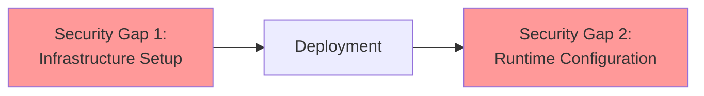
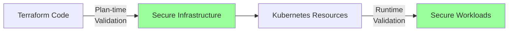
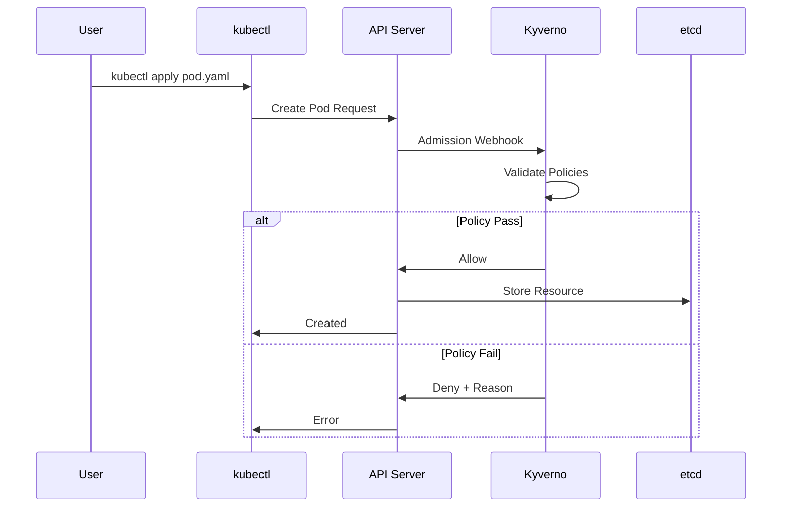
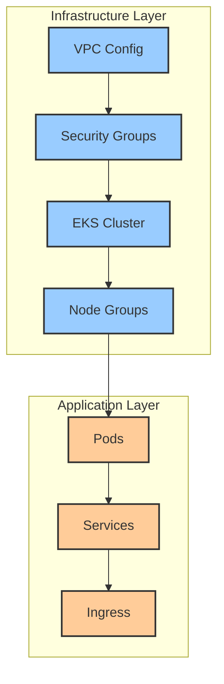

# Dual Strategy: Runtime and Plan-time Validation

## Overview

The CIS EKS Kyverno Compliance Framework implements a unique dual-strategy approach that validates compliance at two critical points:

1. **Plan-time Validation**: Before infrastructure is created (Terraform)
2. **Runtime Validation**: When resources are deployed to Kubernetes

This comprehensive approach ensures security controls are enforced throughout the entire infrastructure lifecycle.

## Why Dual Strategy?

### Traditional Challenges



### Our Solution



## Plan-time Validation

### What It Validates

Plan-time validation catches infrastructure misconfigurations before they're deployed:

- **Cluster Configuration**: Encryption, logging, network settings
- **IAM Policies**: Roles, permissions, service accounts
- **Network Security**: VPC configuration, security groups
- **Compliance Settings**: Audit logs, encryption keys

### How It Works

```bash
# 1. Generate Terraform plan
terraform plan -out=tfplan.binary

# 2. Convert to JSON
terraform show -json tfplan.binary > tfplan.json

# 3. Validate with Kyverno
kyverno apply policies/terraform/ --resource tfplan.json
```

### Example Policy: KMS Encryption

```yaml
apiVersion: json.kyverno.io/v1alpha1
kind: ValidatingPolicy
metadata:
  name: cis-5-3-1-eks-secrets-encryption
spec:
  rules:
    - name: check-kms-encryption
      match:
        any:
        - (planned_values.root_module.resources[?type=='aws_eks_cluster'] | length(@) > `0`): true
      assert:
        all:
        - message: EKS cluster must have secrets encryption enabled
          check:
            ~.(planned_values.root_module.resources[?type=='aws_eks_cluster']):
              (values.encryption_config || `[]` | length(@) > `0`): true
        - message: Encryption must use KMS
          check:
            ~.(planned_values.root_module.resources[?type=='aws_eks_cluster']):
              ~.(values.encryption_config || `[]`):
                ~.(provider || `[]`):
                  key_arn: "?contains(@, 'arn:aws:kms:')"
```

### Benefits

1. **Early Detection**: Catch issues before resources are created
2. **Cost Savings**: Avoid deploying non-compliant infrastructure
3. **Faster Feedback**: Immediate validation in CI/CD pipeline
4. **Shift-Left Security**: Security integrated into development

## Runtime Validation

### What It Validates

Runtime validation ensures ongoing compliance for:

- **Pod Security**: Container configurations, security contexts
- **RBAC**: Role bindings, service account permissions
- **Network Policies**: Ingress/egress rules
- **Resource Configurations**: Labels, annotations, specifications

### How It Works



### Example Policy: Image Scanning

```yaml
apiVersion: kyverno.io/v1
kind: ClusterPolicy
metadata:
  name: cis-5-1-1-require-image-scanning
spec:
  validationFailureAction: enforce
  background: true
  rules:
    - name: check-image-scan-annotation
      match:
        any:
        - resources:
            kinds:
            - Pod
      validate:
        message: "Images must be scanned for vulnerabilities"
        pattern:
          metadata:
            annotations:
              image-scan-completed: "true"
              scan-severity: "?contains(['low', 'medium', 'none'])"
```

### Benefits

1. **Continuous Enforcement**: Policies active 24/7
2. **Immediate Feedback**: Developers know instantly if resources are compliant
3. **Audit Trail**: All validation decisions logged
4. **Dynamic Updates**: Policies can be updated without restart

## Control Mapping

### CIS Controls Coverage

| CIS Section | Plan-time | Runtime | Combined Coverage |
|-------------|-----------|---------|-------------------|
| 2. Control Plane | ✓ | ✓ | 100% |
| 3. Worker Nodes | ✓ | ✓ | 100% |
| 4. RBAC | ✗ | ✓ | 85% |
| 5. Pod Security | △ | ✓ | 95% |

**Legend**: ✓ Full | △ Partial | ✗ None

### Validation Examples by Control

#### Control 2.1.1: Enable Audit Logs

**Plan-time**: Verify EKS cluster configuration includes audit logging
```yaml
# Terraform validation
- Checks: aws_eks_cluster.cluster_enabled_log_types
- Validates: Contains ["api", "audit", "authenticator"]
```

**Runtime**: Ensure audit log ConfigMap exists
```yaml
# Kubernetes validation
- Checks: ConfigMap in kyverno-aws namespace
- Validates: Contains audit configuration
```

#### Control 5.1.3: Minimize ECR Access

**Plan-time**: Validate IAM policies for ECR
```yaml
# Terraform validation
- Checks: aws_iam_policy_document
- Validates: ECR permissions are read-only
```

**Runtime**: Check ServiceAccount annotations
```yaml
# Kubernetes validation
- Checks: ServiceAccount annotations
- Validates: eks.amazonaws.com/role-arn is minimally scoped
```

## Implementation Strategy

### Phase 1: Plan-time First

Start with plan-time validation to prevent misconfigurations:

```bash
# CI/CD Pipeline
stages:
  - terraform_plan
  - plan_validation  # Add this
  - terraform_apply
  - runtime_deploy
```

### Phase 2: Runtime Audit

Deploy runtime policies in audit mode:

```yaml
spec:
  validationFailureAction: audit  # Start here
  # Later: warn
  # Finally: enforce
```

### Phase 3: Full Enforcement

Enable enforcement after remediation:

```bash
# Gradual enforcement
kubectl patch cpol cis-5-1-1 --type='json' \
  -p='[{"op": "replace", "path": "/spec/validationFailureAction", "value": "enforce"}]'
```

## Synergy Benefits

### 1. Complete Coverage



### 2. Defense in Depth

Multiple validation points create layered security:

1. **Development**: Local validation
2. **CI/CD**: Automated checks
3. **Deployment**: Admission control
4. **Runtime**: Continuous monitoring

### 3. Compliance Assurance

```yaml
# Comprehensive compliance tracking
Total Controls: 56
├── Plan-time Only: 8
├── Runtime Only: 12
├── Both: 36
└── Coverage: 95%
```

## Best Practices

### 1. Policy Alignment

Ensure plan-time and runtime policies complement each other:

```yaml
# Plan-time: Ensure KMS key exists
resource "aws_kms_key" "eks" {
  enable_key_rotation = true
}

# Runtime: Ensure encryption is used
metadata:
  annotations:
    encryption-provider: "aws-kms"
```

### 2. Consistent Messaging

Use similar violation messages across both strategies:

```yaml
# Plan-time message
message: "EKS cluster must have audit logging enabled (CIS 2.1.1)"

# Runtime message  
message: "Audit log configuration must be present (CIS 2.1.1)"
```

### 3. Unified Reporting

Combine both validation results:

```bash
# Generate unified compliance report
./scripts/generate-compliance-report.sh --include-terraform --include-runtime
```

## Limitations and Mitigations

### Plan-time Limitations

| Limitation | Mitigation |
|------------|------------|
| Cannot validate dynamic values | Use runtime validation |
| Limited to Terraform resources | Supplement with custom scripts |
| No real-time updates | Implement continuous scanning |

### Runtime Limitations

| Limitation | Mitigation |
|------------|------------|
| Cannot prevent infrastructure issues | Use plan-time validation |
| Performance impact | Optimize policy rules |
| Webhook failures | Implement failure policies |

## Tools and Integration

### Required Tools

1. **Kyverno CLI**: v1.11+ with JSON validation support
2. **Terraform**: v1.0+ with JSON plan output
3. **kubectl**: For runtime policy management
4. **jq**: For JSON processing

### CI/CD Integration

```yaml
# Complete validation pipeline
name: Dual Validation
steps:
  # Plan-time validation
  - name: Terraform Plan Validation
    run: |
      terraform plan -out=plan.tfplan
      terraform show -json plan.tfplan > plan.json
      kyverno apply policies/terraform/ --resource plan.json
      
  # Runtime validation simulation
  - name: Dry-run Kubernetes Policies
    run: |
      kyverno apply policies/kubernetes/ --resource manifests/ --policy-report
```

## Metrics and Monitoring

### Key Metrics

```prometheus
# Plan-time metrics
terraform_validation_total{result="pass|fail"}
terraform_validation_duration_seconds

# Runtime metrics
kyverno_policy_rule_results_total{policy="cis-*", result="pass|fail"}
kyverno_admission_requests_total{resource="Pod|Service|ConfigMap"}
```

### Dashboards

Create unified dashboards showing both validation types:

```grafana
Row 1: Plan-time Validation
- Terraform validation success rate
- Failed validations by control
- Validation duration trends

Row 2: Runtime Validation
- Policy violations by namespace
- Admission rejection rate
- Compliance score over time
```

## Future Enhancements

### Planned Features

1. **Unified Policy Language**: Single policy for both validation types
2. **Real-time Sync**: Automatic policy synchronization
3. **ML-based Recommendations**: Suggest policy improvements
4. **Multi-cloud Support**: Extend beyond AWS EKS

### Research Areas

- Policy optimization algorithms
- Automated remediation workflows
- Compliance prediction models
- Cross-cloud policy translation

## Conclusion

The dual-strategy approach provides comprehensive security coverage throughout the infrastructure lifecycle. By combining plan-time and runtime validation, organizations can achieve:

- **Higher compliance rates** through early detection
- **Reduced security incidents** via continuous enforcement
- **Improved developer experience** with immediate feedback
- **Complete audit trails** for compliance reporting

Next, explore the [technical components](components.md) that make this dual strategy possible.