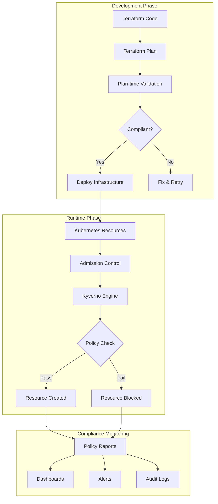

# Architecture Overview

## Introduction

The CIS EKS Kyverno Compliance Framework provides a comprehensive solution for enforcing Center for Internet Security (CIS) Amazon EKS Benchmark controls using Kyverno policy engine. This architecture enables both runtime validation in Kubernetes clusters and plan-time validation for Terraform infrastructure as code.

## High-Level Architecture



## Core Components

### 1. Kyverno Policy Engine

Kyverno is a policy engine designed for Kubernetes that enables:

- **Declarative Policies**: Policies defined as Kubernetes resources (YAML)
- **No Programming Required**: Policy logic expressed in familiar YAML/JSON
- **Dynamic Admission Control**: Real-time resource validation
- **Policy Reports**: Native Kubernetes resources for compliance tracking

### 2. Policy Categories

The framework organizes policies into five main categories aligned with CIS EKS Benchmark sections:

```
policies/
├── kubernetes/               # Runtime validation policies
│   ├── control-plane/       # Section 2: Control Plane Configuration
│   ├── worker-nodes/        # Section 3: Worker Node Security
│   ├── rbac/               # Section 4: RBAC and Service Accounts
│   └── pod-security/       # Section 5: Pod Security Standards
└── terraform/              # Plan-time validation policies
    ├── cluster-config/     # EKS cluster settings
    ├── networking/         # VPC and network policies
    ├── encryption/         # KMS and data encryption
    └── monitoring/         # Logging and audit configuration
```

### 3. Validation Modes

#### Runtime Validation
- **Target**: Live Kubernetes resources
- **Method**: Admission webhooks
- **Timing**: Resource creation/update
- **Actions**: Audit, Warn, or Enforce

#### Plan-time Validation
- **Target**: Terraform plan JSON
- **Method**: CLI validation
- **Timing**: Pre-deployment
- **Actions**: Pass/Fail with detailed reports

## Policy Lifecycle

### 1. Policy Development

```yaml
# Example: CIS 5.1.1 - Image Vulnerability Scanning
apiVersion: kyverno.io/v1
kind: ClusterPolicy
metadata:
  name: cis-5-1-1-image-scanning
  annotations:
    policies.kyverno.io/cis-control: "5.1.1"
spec:
  validationFailureAction: audit
  rules:
    - name: check-image-scanning
      match:
        resources:
          kinds: ["Pod"]
      validate:
        message: "Images must be scanned"
        pattern:
          metadata:
            annotations:
              image-scan-completed: "true"
```

### 2. Testing Pipeline

```
Test Development → Unit Tests → Integration Tests → Deployment
      ↓                ↓              ↓                ↓
  Write Tests    Local Testing   CI/CD Pipeline   Production
```

### 3. Deployment Strategies

**Progressive Rollout**:
1. **Audit Mode**: Monitor violations without blocking
2. **Warn Mode**: Alert users but allow resources
3. **Enforce Mode**: Block non-compliant resources

## Integration Points

### 1. CI/CD Integration

```yaml
# GitHub Actions Example
- name: Validate Kubernetes Manifests
  run: kyverno apply policies/ --resource manifests/

- name: Validate Terraform Plans
  run: |
    terraform plan -out=plan.tfplan
    terraform show -json plan.tfplan > plan.json
    kyverno apply policies/terraform/ --resource plan.json
```

### 2. GitOps Integration

```yaml
# Flux/ArgoCD Example
apiVersion: kustomize.toolkit.fluxcd.io/v1
kind: Kustomization
metadata:
  name: cis-policies
spec:
  sourceRef:
    kind: GitRepository
    name: cis-eks-kyverno
  path: ./policies/kubernetes
  prune: true
  validation: client
```

### 3. Monitoring Integration

```yaml
# Prometheus Metrics
kyverno_policy_rule_results_total{
  policy="cis-5-1-1-image-scanning",
  rule="check-image-scanning",
  result="pass"
} 142

kyverno_policy_rule_results_total{
  policy="cis-5-1-1-image-scanning",
  rule="check-image-scanning",
  result="fail"
} 8
```

## Data Flow

### 1. Resource Admission Flow

```
kubectl apply → API Server → Webhook → Kyverno → Policy Check
                                ↓                      ↓
                            Mutate?              Pass/Fail
                                ↓                      ↓
                           Generate?            Allow/Deny
                                ↓                      ↓
                           Validate ← ← ← ← ← Resource Status
```

### 2. Policy Report Generation

```
Policy Execution → Result Collection → Report Aggregation → Storage
        ↓                 ↓                    ↓              ↓
   Pass/Fail         PolicyReport         Namespace/       Kubernetes
                      Resources          Cluster-wide         API
```

## Security Architecture

### 1. RBAC Model

```yaml
# Kyverno Service Account Permissions
- apiGroups: ["*"]
  resources: ["*"]
  verbs: ["get", "list", "watch"]
  
# Policy Management Permissions  
- apiGroups: ["kyverno.io"]
  resources: ["policies", "clusterpolicies"]
  verbs: ["create", "update", "delete"]
```

### 2. Webhook Security

- **TLS Encryption**: All webhook communication encrypted
- **Certificate Management**: Automatic rotation via cert-manager
- **Authentication**: Service account tokens
- **Authorization**: RBAC policies

### 3. Policy Exceptions

```yaml
apiVersion: kyverno.io/v1
kind: PolicyException
metadata:
  name: delta-exception
spec:
  exceptions:
  - policyName: cis-*
    ruleNames: ["*"]
  match:
    any:
    - resources:
        names: ["delta-*"]
        namespaces: ["platform-tools"]
```

## Scalability Considerations

### 1. Performance Optimization

- **Webhook Timeout**: 30 seconds max
- **Policy Caching**: In-memory policy cache
- **Parallel Processing**: Multi-threaded validation
- **Resource Limits**: CPU/Memory constraints

### 2. High Availability

```yaml
# Kyverno Deployment
spec:
  replicas: 3
  strategy:
    type: RollingUpdate
  affinity:
    podAntiAffinity:
      requiredDuringSchedulingIgnoredDuringExecution:
      - topologyKey: kubernetes.io/hostname
```

### 3. Load Distribution

- **Horizontal Scaling**: Multiple Kyverno replicas
- **Load Balancing**: Kubernetes service distribution
- **Regional Distribution**: Multi-region deployment support

## Operational Model

### 1. Day-0: Initial Setup
- Install Kyverno
- Deploy policies in audit mode
- Configure monitoring

### 2. Day-1: Rollout
- Review audit findings
- Create exceptions as needed
- Enable enforcement gradually

### 3. Day-2: Operations
- Monitor compliance metrics
- Update policies for new controls
- Manage policy lifecycle

## Technology Stack

| Component | Technology | Purpose |
|-----------|------------|---------|
| Policy Engine | Kyverno v1.11+ | Core validation engine |
| Container Platform | Kubernetes 1.24+ | Runtime environment |
| IaC | Terraform 1.0+ | Infrastructure provisioning |
| Monitoring | Prometheus/Grafana | Metrics and dashboards |
| CI/CD | GitHub Actions | Automation pipeline |
| GitOps | Flux/ArgoCD | Declarative deployment |

## Design Principles

1. **Declarative**: All policies defined as code
2. **Auditable**: Complete audit trail of all decisions
3. **Scalable**: Handles enterprise workloads
4. **Extensible**: Easy to add new policies
5. **Cloud-Native**: Kubernetes-native implementation
6. **Zero-Trust**: Default deny with explicit allows
7. **Progressive**: Gradual enforcement model

## Next Steps

- Review the [Dual Strategy](dual-strategy.md) approach
- Understand [Component Details](components.md)
- Explore [Policy Documentation](../policies/)
- Check [Implementation Examples](../../examples/)