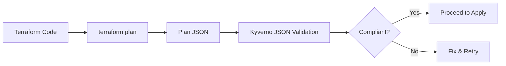

# Terraform Plan-time Policies

Documentation for Terraform plan validation policies that enforce CIS EKS Benchmark controls before infrastructure deployment.

## Overview

Plan-time policies validate Terraform configurations before resources are created in AWS. These policies use Kyverno's JSON validation capabilities to analyze Terraform plan files and ensure infrastructure compliance.

## How It Works



## Policy Structure

Terraform policies use the `json.kyverno.io/v1alpha1` API:

```yaml
apiVersion: json.kyverno.io/v1alpha1
kind: ValidatingPolicy
metadata:
  name: cis-control-name
  annotations:
    policies.kyverno.io/cis-control: "X.Y.Z"
spec:
  rules:
    - name: validate-setting
      match:
        any:
        - (planned_values.root_module.resources[?type=='aws_eks_cluster']): true
      assert:
        all:
        - message: "Validation message"
          check:
            # JSONPath validation logic
```

## Key Policies

### cis-2.1.1 - Enable Audit Logs

Ensures EKS clusters have audit logging enabled:

```yaml
assert:
  all:
  - message: "EKS cluster must have audit logging enabled"
    check:
      ~.(planned_values.root_module.resources[?type=='aws_eks_cluster']):
        values:
          enabled_cluster_log_types:
            (contains(@, 'api') && contains(@, 'audit')): true
```

**What it validates**:
- Cluster has logging configuration
- Includes both 'api' and 'audit' log types
- CloudWatch integration configured

### cis-5.3.1 - Encrypt Secrets with KMS

Validates encryption configuration:

```yaml
assert:
  all:
  - message: "EKS secrets must be encrypted with KMS"
    check:
      ~.(planned_values.root_module.resources[?type=='aws_eks_cluster']):
        values:
          encryption_config:
            - resources: 
                (contains(@, 'secrets')): true
              provider:
                key_arn: "?contains(@, 'arn:aws:kms:')"
```

**What it validates**:
- Encryption config block exists
- Covers 'secrets' resource type
- Uses AWS KMS key (not default)

### cis-5.4.2 - Private Endpoint Access

Ensures clusters use private endpoints:

```yaml
assert:
  all:
  - message: "EKS endpoint should be private"
    check:
      ~.(planned_values.root_module.resources[?type=='aws_eks_cluster']):
        values:
          endpoint_private_access: true
          endpoint_public_access: false
```

**Alternative** (restricted public):
```yaml
values:
  endpoint_public_access: true
  public_access_cidrs:
    # Not 0.0.0.0/0
    (!contains(@, '0.0.0.0/0')): true
```

### cis-5.4.3 - Private Worker Nodes

Validates node group configuration:

```yaml
assert:
  all:
  - message: "Worker nodes must be in private subnets"
    check:
      ~.(planned_values.root_module.resources[?type=='aws_eks_node_group']):
        values:
          subnet_ids:
            # All subnets should be private
            (~[*]): "?contains(@, 'private')"
```

### cis-5.4.4 - Network Policy Support

Checks for VPC CNI configuration:

```yaml
assert:
  all:
  - message: "Enable network policy support"
    check:
      ~.(planned_values.root_module.resources[?type=='aws_eks_addon'][?values.addon_name=='vpc-cni']):
        values:
          configuration_values:
            (contains(@, 'enableNetworkPolicy')): true
```

## Validation Process

### 1. Generate Terraform Plan

```bash
cd terraform/your-eks-config
terraform init
terraform plan -out=tfplan.binary
```

### 2. Convert to JSON

```bash
terraform show -json tfplan.binary > tfplan.json
```

### 3. Run Validation

```bash
# Enable experimental features
export KYVERNO_EXPERIMENTAL=true

# Validate all policies
kyverno apply policies/terraform/ --resource tfplan.json

# Validate specific policy
kyverno apply policies/terraform/cis-5.3.1-encrypt-secrets-kms.yaml \
  --resource tfplan.json
```

## Policy Examples

### Resource Tagging

Ensure all resources have required tags:

```yaml
apiVersion: json.kyverno.io/v1alpha1
kind: ValidatingPolicy
metadata:
  name: require-tags
spec:
  rules:
    - name: check-required-tags
      match:
        any:
        - (planned_values.root_module.resources[*]): true
      assert:
        all:
        - message: "Resources must have required tags"
          check:
            ~.(planned_values.root_module.resources[*]):
              values.tags:
                Environment: "?*"
                Owner: "?*"
                CostCenter: "?*"
```

### IAM Role Validation

Ensure EKS roles follow least privilege:

```yaml
assert:
  all:
  - message: "EKS role must not have admin access"
    check:
      ~.(planned_values.root_module.resources[?type=='aws_iam_role_policy_attachment']):
        values:
          (?contains(policy_arn, 'AdministratorAccess')): false
```

## Limitations

### Plan-time Constraints

1. **Computed Values**: Some values only available after apply
2. **Dynamic Resources**: Resources created by AWS
3. **External Dependencies**: Resources outside Terraform

### Workarounds

For computed values, check for configuration presence:

```yaml
# Instead of checking the actual KMS key ARN
key_arn: "?contains(@, 'arn:aws:kms:')"

# Check that a KMS key is configured
encryption_config:
  (length(@) > `0`): true
```

## CI/CD Integration

### GitHub Actions

```yaml
name: Terraform Compliance Check
on: [pull_request]

jobs:
  validate:
    runs-on: ubuntu-latest
    steps:
      - uses: actions/checkout@v3
      
      - name: Setup Terraform
        uses: hashicorp/setup-terraform@v2
        
      - name: Generate Plan
        run: |
          terraform init
          terraform plan -out=tfplan.binary
          terraform show -json tfplan.binary > tfplan.json
          
      - name: Install Kyverno
        run: |
          curl -L $KYVERNO_URL | tar -xz
          sudo mv kyverno /usr/local/bin/
          
      - name: Validate Plan
        env:
          KYVERNO_EXPERIMENTAL: true
        run: |
          kyverno apply policies/terraform/ --resource tfplan.json
```

### GitLab CI

```yaml
terraform-validate:
  stage: validate
  script:
    - terraform init
    - terraform plan -out=plan.tfplan
    - terraform show -json plan.tfplan > plan.json
    - export KYVERNO_EXPERIMENTAL=true
    - kyverno apply policies/terraform/ --resource plan.json
  only:
    - merge_requests
```

## Testing Policies

### Test Structure

```
terraform/
├── compliant/
│   ├── main.tf          # Compliant configuration
│   ├── tfplan.json      # Generated plan
│   └── expected.yaml    # Expected results
└── noncompliant/
    ├── main.tf          # Non-compliant configuration
    ├── tfplan.json      # Generated plan
    └── expected.yaml    # Expected violations
```

### Running Tests

```bash
# Automated test script
./scripts/test-terraform-cis-policies.sh

# Manual testing
cd terraform/compliant
terraform plan -out=tfplan.binary
terraform show -json tfplan.binary > tfplan.json
kyverno apply ../../policies/terraform/ --resource tfplan.json
```

## Best Practices

### 1. Fail Fast

Validate early in the pipeline:
```yaml
stages:
  - validate    # Terraform plan validation
  - test        # Unit tests
  - deploy      # Only if validation passes
```

### 2. Clear Messages

Provide actionable error messages:
```yaml
message: |
  EKS cluster must have audit logging enabled.
  Add to your Terraform configuration:
    enabled_cluster_log_types = ["api", "audit", "authenticator"]
```

### 3. Progressive Validation

Start with critical controls:
1. Encryption (5.3.1)
2. Private endpoints (5.4.2)
3. Audit logging (2.1.1)
4. Then add additional controls

### 4. Exception Handling

Document approved exceptions:
```yaml
# terraform/exceptions.yaml
exceptions:
  - control: "5.4.2"
    reason: "Public endpoint required for GitHub Actions"
    mitigations: 
      - "Restricted to GitHub IP ranges"
      - "Additional authentication required"
    approved_by: "security-team"
    expires: "2024-12-31"
```

## Troubleshooting

### Common Issues

1. **Policy Not Matching**
   ```bash
   # Debug JSONPath
   cat tfplan.json | jq '.planned_values.root_module.resources[] | select(.type=="aws_eks_cluster")'
   ```

2. **Validation Errors**
   ```bash
   # Verbose output
   kyverno apply policy.yaml --resource tfplan.json -v 5
   ```

3. **Complex Assertions**
   ```yaml
   # Break into multiple checks
   assert:
     all:
     - message: "Check 1"
       check: ...
     - message: "Check 2"
       check: ...
   ```

## Advanced Patterns

### Multi-Resource Validation

Validate relationships between resources:

```yaml
# Ensure node groups use cluster security group
assert:
  all:
  - message: "Node groups must use cluster security group"
    check:
      (let cluster_sg = planned_values.root_module.resources[?type=='aws_eks_cluster'].values.vpc_config.cluster_security_group_id | [0]; 
       planned_values.root_module.resources[?type=='aws_eks_node_group'].values.remote_access.source_security_group_ids[*] | 
       contains(@, $cluster_sg)): true
```

### Conditional Validation

Apply rules based on environment:

```yaml
# Only enforce in production
match:
  any:
  - (planned_values.root_module.resources[?type=='aws_eks_cluster' && contains(values.tags.Environment, 'production')]): true
```

## Next Steps

- Review [policy limitations](limitations.md) for constraints
- See [Kubernetes policies](kubernetes-policies.md) for runtime validation
- Check [examples](../../examples/) for complete implementations